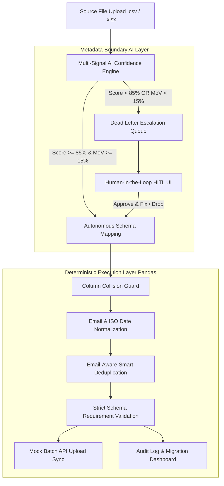

# 🚀 Enterprise HCM Data Agent

> **Hybrid Autonomous Metadata Mapping Engine with Multi-Signal AI Confidence Scoring & Deterministic Python ETL Execution Pipeline**

[](https://www.python.org/)
[](https://pandas.pydata.org/)
[](https://gradio.app/)
[](LICENSE)

---

## 📌 Architectural Philosophy: Hybrid Execution

Traditional enterprise data migrations fail when source export files encounter unexpected headers or schema drifts. Conversely, fully LLM-driven row migrations are unpredictable and risk hallucinating sensitive PII data (e.g. silently corrupting phone numbers or email addresses).

This project bridges the gap using a **Hybrid Architecture**:
1. **Probabilistic Reasoning at the Metadata Layer:** Restricted strictly to header semantic mapping and confidence scoring.
2. **Deterministic Execution at the Row Data Layer:** Handled entirely by auditable, high-performance Python (Pandas). Zero LLM touching of raw row data guarantees 100% data fidelity, SOC2 compliance, and computational efficiency.

---

## 🏗️ System Architecture & Workflow



---

## 🔥 Key Architectural Features

### 1. Multi-Signal Confidence Engine
To dictate the escalation boundary autonomously, the engine evaluates source column candidate scores using two mathematical criteria:
- **Absolute Confidence Threshold ($>85\%$):** Top candidate match score must exceed 85%.
- **Margin of Victory Threshold ($>15\%$):** Top candidate score must beat the second-best candidate by at least 15%. If `Emp_Name` scores 89% for `first_name` and 89% for `last_name`, the engine detects ambiguity and routes it to human review.

### 2. Dead Letter Escalation Queue & HITL UI
- Surfaces ambiguous mappings with detailed mathematical context explaining the exact boundary condition triggered.
- Interactive JSON payload editor allowing human reviewers to override mappings or drop unmapped columns.

### 3. Deterministic ETL Pipeline
- **Email Normalization:** Trims whitespace, lowercases, and standardizes missing/null variants (`""`, `"nan"`, `"null"`, `"n/a"`) to `None`.
- **Date Normalization:** Parses arbitrary input dates into ISO `YYYY-MM-DD` format with regex validation.
- **Smart Deduplication:** Deduplicates valid emails while preserving null-email rows for validation auditing.
- **Granular Failure Reporting:** Row-level audit trace for failed records.

---

## 🛠️ Project Structure

```text
Enterprise-HCM/
├── app.py                                   # Production Gradio Web App & ETL Engine
├── thefinalcall.ipynb                       # Standalone Jupyter Notebook Pipeline
├── Enterprise HCM Data Agent Architect.txt  # System Architecture Documentation
├── sample_hr_data.csv                       # Synthetic Test HR Dataset
├── one page note.pdf                        # Architectural Overview PDF
└── .gitignore                               # Git ignore configuration
```

## 📊 Sample Pipeline Output

```json
{
  "processed": 6,
  "duplicates": 1,
  "failed": 3,
  "uploaded": 2
}
```

| Metric | Count | Details |
| :--- | :---: | :--- |
| **Ingested Records** | **6** | Raw input rows |
| **Duplicates Removed** | **1** | Deduplicated based on valid email address |
| **Validation Failures** | **3** | Missing email (1), Invalid date format (1), Missing required status (1) |
| **Successfully Inserted** | **2** | 201 Created via REST API Upload |

---

## 👨‍💻 Author

**Mistervivek**
